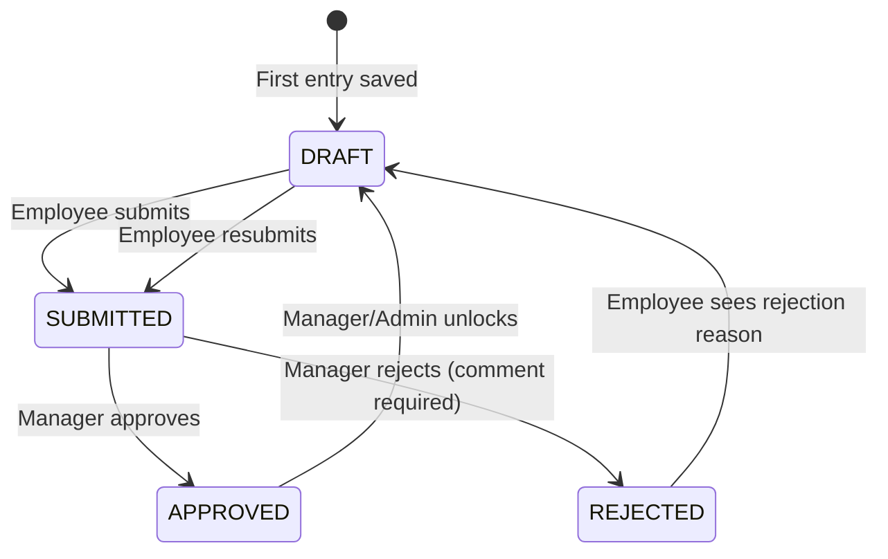
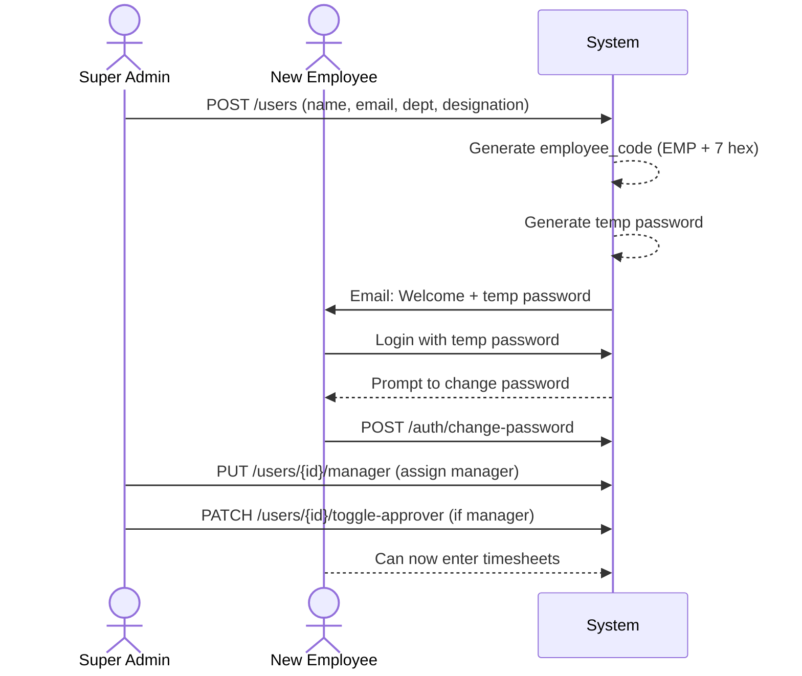
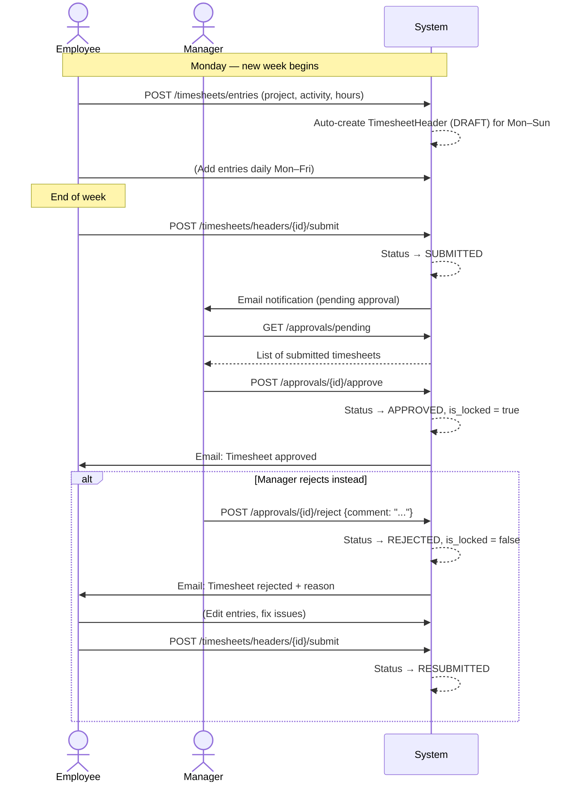
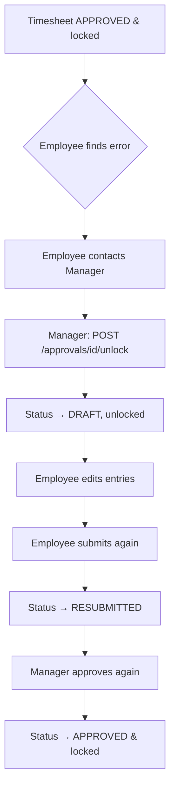
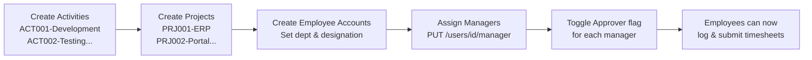
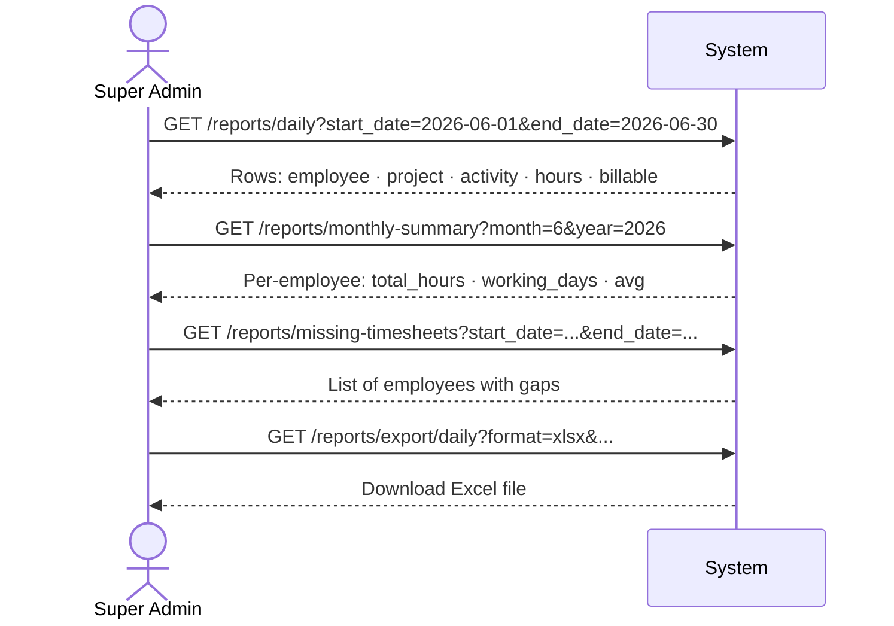
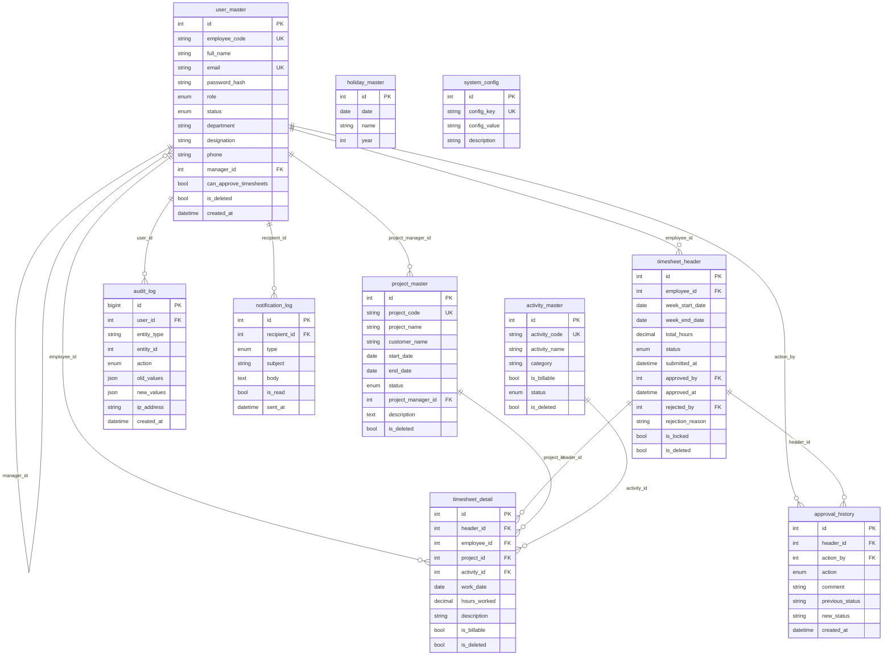
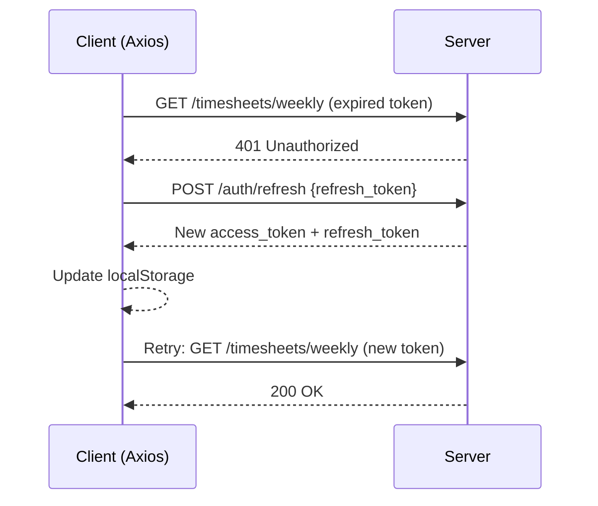
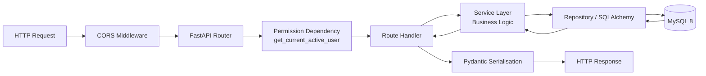

# HourHive — Complete Product Documentation

> **Version**: 1.0.0 | **Last Updated**: July 2026 | **Stack**: FastAPI · React 19 · MySQL 8

---

## Table of Contents

1. [Product Overview](#1-product-overview)
2. [User Roles & Permissions](#2-user-roles--permissions)
3. [Navigation Map](#3-navigation-map)
4. [Modules & Features](#4-modules--features)
   - 4.1 [Authentication](#41-authentication)
   - 4.2 [Dashboard](#42-dashboard)
   - 4.3 [Timesheet Entry](#43-timesheet-entry)
   - 4.4 [Timesheet Approvals](#44-timesheet-approvals)
   - 4.5 [Reports & Analytics](#45-reports--analytics)
   - 4.6 [User Management](#46-user-management)
   - 4.7 [Project Management](#47-project-management)
   - 4.8 [Activity Management](#48-activity-management)
   - 4.9 [Organisation Hierarchy](#49-organisation-hierarchy)
   - 4.10 [Holiday Management](#410-holiday-management)
   - 4.11 [Audit Logs](#411-audit-logs)
   - 4.12 [System Configuration](#412-system-configuration)
5. [Business Rules](#5-business-rules)
6. [CRUD Reference](#6-crud-reference)
7. [End-to-End Workflows](#7-end-to-end-workflows)
8. [Data Model (ERD)](#8-data-model-erd)
9. [API Reference Summary](#9-api-reference-summary)
10. [Frontend Architecture](#10-frontend-architecture)
11. [Backend Architecture](#11-backend-architecture)
12. [FAQ](#12-faq)
13. [Known Missing Features](#13-known-missing-features)
14. [Enterprise Improvement Suggestions](#14-enterprise-improvement-suggestions)

---

## 1. Product Overview

**HourHive** is an enterprise-grade Time Tracking & Workforce Productivity Platform built for organisations that need accurate logging of employee work hours against projects and activities, with a manager-driven weekly approval workflow.

### Core Value Proposition

| Problem | HourHive Solution |
|---|---|
| Employees forget to log time | Daily entry UI + scheduled email reminders |
| Hours logged to wrong projects | Project & activity master controlled by admin |
| No visibility into team utilisation | Approver dashboard with charts and KPIs |
| Compliance & audit requirements | Immutable approval history + full audit log |
| Backdating abuse | Configurable backdating window (default 7 days) |
| Report export for billing | Excel & PDF export from reports module |

### Tech Stack at a Glance

```
Backend  : FastAPI 0.115 · SQLAlchemy 2.0 · MySQL 8 · Pydantic v2 · JWT (HS256)
Frontend : React 19 · Vite 5 · TailwindCSS 3 · Zustand · React Query · Recharts
Email    : FastAPI-Mail (SMTP / Gmail)
Jobs     : APScheduler (reminder emails)
Export   : openpyxl (Excel) · reportlab (PDF)
```

---

## 2. User Roles & Permissions

HourHive uses a **two-role model** augmented by a per-user **permission flag**.

### Roles

| Role | Value in DB | Who holds it |
|---|---|---|
| Super Admin | `super_admin` | System administrator / HR admin |
| Employee | `employee` | All other staff, including managers |

### Manager Concept

There is **no separate Manager role**. A manager is simply an `employee` with:
- `manager_id` populated on their direct reports (they are assigned as someone's manager)
- `can_approve_timesheets = true` (toggled by Super Admin)

On their sidebar, manager-employees see an **Approvals** menu item that ordinary employees do not.

### Permission Matrix

| Feature | Super Admin | Employee (Manager) | Employee |
|---|---|---|---|
| View own dashboard | ✅ | ✅ | ✅ |
| Enter own timesheets | ✅ | ✅ | ✅ |
| Submit own timesheets | ✅ | ✅ | ✅ |
| View own reports | ✅ | ✅ | ✅ |
| Approve/Reject timesheets | ✅ (any) | ✅ (direct reports only) | ❌ |
| Unlock approved timesheets | ✅ | ✅ (direct reports only) | ❌ |
| View all employees' reports | ✅ | ❌ | ❌ |
| Create / deactivate users | ✅ | ❌ | ❌ |
| Assign managers | ✅ | ❌ | ❌ |
| Toggle approver permission | ✅ | ❌ | ❌ |
| Create / edit projects | ✅ | ❌ | ❌ |
| Create / edit activities | ✅ | ❌ | ❌ |
| Manage holidays | ✅ | ❌ | ❌ |
| View audit logs | ✅ | ❌ | ❌ |
| Edit system config | ✅ | ❌ | ❌ |
| Export reports (Excel/PDF) | ✅ | ❌ | ❌ |

---

## 3. Navigation Map

```
/login                          Public — login form
/register                       Public — self-registration
/forgot-password                Public — request reset email
/reset-password?token=...       Public — set new password

/dashboard                      All roles (role-aware view)
/timesheets                     All roles — list of submitted weeks
/timesheets/entry               All roles — daily entry form
/timesheets/weekly              All roles — weekly grid view
/approvals                      Super Admin + Managers only
/reports                        All roles (filters vary by role)
/analytics                      All roles
/profile                        All roles (employee profile page)

── Super Admin only ──
/users                          User management
/projects                       Project master
/activities                     Activity master
/organisation                   Org hierarchy tree
/approver-mapping               Configure manager–approver relationships
/holidays                       Holiday calendar
/audit-logs                     Full audit trail
```

---

## 4. Modules & Features

### 4.1 Authentication

#### Features
- **Email/password login** with JWT access + refresh tokens
- **Self-registration** (creates an `employee` account; Super Admin promotes as needed)
- **Forgot password** — sends reset link to registered email via SMTP
- **Reset password** — tokenised link valid for 2 hours
- **Change password** — requires current password for verification
- **Auto token refresh** — Axios interceptor silently refreshes on 401 and retries the original request
- **Account deactivation guard** — inactive users are blocked at login

#### Token Lifecycle

```
Access Token  : 60 minutes (configurable)
Refresh Token : 7 days (configurable)
Reset Token   : 2 hours (one-time use)
```

#### Password Rules
- Stored as bcrypt hash (no plain-text ever persisted)
- Temp passwords generated on admin-created accounts; user must change on first login
- Reset tokens are invalidated after use (set to `NULL` in DB)

---

### 4.2 Dashboard

The dashboard is **role-aware** — the same `/dashboard` route renders different views.

#### Employee Dashboard
| Widget | Description |
|---|---|
| Current Month Hours | Total hours logged in the current calendar month |
| Submitted / Pending / Approved / Rejected | Count of weekly timesheet statuses |
| Weekly Hours Trend | Bar chart — last 4 weeks |
| Recent Entries | Last 5 timesheet detail rows |
| Activity Heatmap | Day-level intensity grid |

#### Super Admin / Approver Dashboard
| Widget | Description |
|---|---|
| Pending Approvals | Count of submitted timesheets awaiting review |
| Approved This Month | Count of approved timesheets in current month |
| Rejected This Month | Count of rejected timesheets |
| Missing Timesheets | Employees who haven't submitted for the current week |
| Total Employees | Active headcount |
| Avg Hours / Employee | Monthly average (computed via subquery aggregate) |
| Active Projects | Count of projects with status = active |
| Monthly Hours Chart | Bar chart trend of total hours logged |
| Dept Breakdown | Pie/donut chart — hours by department |
| Top Projects | Table of projects ranked by hours |
| Pending Approvals List | Actionable list of timesheets to review |

---

### 4.3 Timesheet Entry

The core module. Employees log work hours daily or via weekly grid.

#### Daily Entry Form (`/timesheets/entry`)
- Select **Project** (active projects dropdown)
- Select **Activity** (active activities dropdown)
- Enter **Work Date** (today or backdated within limit)
- Enter **Hours** (0.25 increments, max configured daily limit)
- Optional **Description** (free text)
- Toggle **Billable** flag
- Multiple entries allowed per day (different project/activity combinations)

#### Weekly Grid View (`/timesheets/weekly`)
- Mon–Sun grid with rows per project/activity combination
- Editable cells for each day
- Row totals and day totals auto-calculated
- **Copy Day** — copies all entries from one date to another (shortcut for repetitive work)
- Submit button at week level (submits entire week to approver)

#### Timesheet List (`/timesheets`)
- Paginated list of all submitted/approved/rejected weeks
- Status badges
- Click to drill into a week's details

#### Status Flow



---

### 4.4 Timesheet Approvals

Available to Super Admin and employees with `can_approve_timesheets = true`.

#### Pending Queue (`/approvals`)
- Lists all timesheets with status `SUBMITTED` or `RESUBMITTED`
- **Managers** see only their direct reports' timesheets
- **Super Admin** sees every timesheet in the system

#### Actions
| Action | Who | Rule |
|---|---|---|
| Approve | Manager / Super Admin | Sets status → APPROVED, locks timesheet |
| Reject | Manager / Super Admin | Requires comment; sets status → REJECTED, unlocks |
| Unlock | Manager / Super Admin | Only on APPROVED timesheets; reverts to DRAFT for editing |

#### Approval History
Every action (submit, approve, reject, unlock, resubmit) is written to an immutable `approval_history` table with:
- Actor, timestamp, action type
- Previous and new status
- Optional comment

This provides a complete **audit trail per timesheet**.

---

### 4.5 Reports & Analytics

#### Report Types

| Report | Filters | Output |
|---|---|---|
| Daily Report | Date range, employee, project | Row per entry: date · employee · project · activity · hours · billable |
| Monthly Summary | Month, year, employee | Row per employee: total hours · working days · avg daily hours |
| Project Effort | Date range, project | Row per project: total · billable · non-billable hours |
| Activity Breakdown | Date range, employee | Row per activity: hours + percentage of total |
| Missing Timesheets | Date range | List of employees with no submission for weeks in range |
| Month Comparison | Two months, employee | Side-by-side comparison of hours |

#### Export
Daily reports can be exported as **Excel (.xlsx)** or **PDF** via the Export button (Super Admin only).

#### Analytics Page (`/analytics`)
Visual charts and summary cards for pattern analysis.

---

### 4.6 User Management

Super Admin only. Located at `/users`.

#### Features
- **List users** — searchable, filterable by role and status, paginated
- **Create user** — fills all profile fields; system generates temp password and emails it
- **Edit user** — update name, email, department, designation, phone
- **Deactivate / Activate** — soft status toggle (does not delete data)
- **Assign Manager** — sets `manager_id`; determines approval routing
- **Toggle Approver** — sets `can_approve_timesheets`; shows Approvals tab on employee's sidebar

#### User Fields

| Field | Required | Notes |
|---|---|---|
| Full Name | ✅ | |
| Email | ✅ | Must be unique |
| Employee Code | ✅ | Auto-generated: `EMP` + 7 hex chars |
| Role | ✅ | `super_admin` or `employee` |
| Department | Optional | Used for dept-breakdown charts |
| Designation | Optional | |
| Phone | Optional | |
| Manager | Optional | Set via Assign Manager action |
| can_approve_timesheets | Optional | Boolean toggle, default false |

---

### 4.7 Project Management

Super Admin only. Located at `/projects`.

#### Features
- **List projects** — search by name/code, filter by status, paginated
- **Create project** — code, name, customer, dates, manager, description
- **Edit project** — all fields + status change
- **Deactivate** — removes from employee dropdowns (historical data preserved)

#### Project Fields

| Field | Required | Notes |
|---|---|---|
| Project Code | ✅ | Unique, e.g. `PRJ001` |
| Project Name | ✅ | |
| Customer Name | ✅ | |
| Start Date | ✅ | |
| End Date | Optional | |
| Project Manager | Optional | FK to user |
| Status | ✅ | `active` · `inactive` · `completed` · `on_hold` |
| Description | Optional | |

---

### 4.8 Activity Management

Super Admin only. Located at `/activities`.

#### Features
- **List activities** — paginated
- **Create activity** — code, name, category, billable flag
- **Edit activity**
- **Activate / Deactivate** — controls visibility in timesheet dropdowns

#### Activity Fields

| Field | Required | Notes |
|---|---|---|
| Activity Code | ✅ | Unique, e.g. `ACT001` |
| Activity Name | ✅ | |
| Category | ✅ | e.g. Development, Testing, Documentation |
| Is Billable | ✅ | Boolean, defaults to `true` |
| Status | ✅ | `active` / `inactive` |

---

### 4.9 Organisation Hierarchy

Super Admin only. Located at `/organisation`.

- Visual tree of the entire company structure
- Shows manager → direct reports relationships
- Used to verify approval routing is set up correctly

#### Approver Mapping (`/approver-mapping`)
- Configure which employees are managers
- Assign direct reports to each manager
- One-click toggle of `can_approve_timesheets`

---

### 4.10 Holiday Management

Super Admin only. Located at `/holidays`.

#### Features
- **List holidays** by year
- **Create holiday** — date + name
- **Delete holiday**
- **Upload holiday PDF** — attach the official holiday calendar for the year
- **Download holiday PDF**

Holidays are used by the reporting module to calculate actual **working days** and are displayed in the timesheet entry calendar.

---

### 4.11 Audit Logs

Super Admin only. Located at `/audit-logs`.

Every create, update, and delete action on any major entity is written to an **immutable** `audit_log` table. Logs capture:
- Who performed the action (user ID + IP address)
- Which entity and record ID was affected
- The action type (CREATE / UPDATE / DELETE)
- JSON snapshots of old and new values
- Timestamp

Logs can be filtered by entity type, entity ID, or acting user.

---

### 4.12 System Configuration

Super Admin only. Accessed via `/config` API (no dedicated UI page currently).

| Config Key | Default | Description |
|---|---|---|
| `backdated_days_limit` | 7 | How many days back employees can log time |
| `max_daily_hours` | 12 | Maximum hours allowed per employee per day |

Changes take effect immediately without restarting the server.

---

## 5. Business Rules

### Timesheet Rules

1. **Minimum increment**: Hours must be entered in **0.25 (15-minute) multiples**. Values like 1.3 or 2.7 are rejected.
2. **Daily cap**: Total hours per employee per day cannot exceed `max_daily_hours` (default 12).
3. **No future dates**: Work dates in the future are rejected at the API level.
4. **Backdating window**: Work dates older than `backdated_days_limit` days are rejected.
5. **Week boundaries**: Timesheets are per Mon–Sun week. An entry on any day of the week auto-creates or attaches to that week's header.
6. **Locked timesheets**: Once a week is approved, all entries are **locked** (`is_locked = true`). Edits require an unlock action from the manager or Super Admin.
7. **Submission**: An employee can submit only **DRAFT** or **REJECTED** (resubmit) timesheets.

### Approval Rules

1. **Scope**: A manager can approve only timesheets belonging to their **direct reports**.
2. **Super Admin override**: Super Admin can approve, reject, or unlock **any** timesheet.
3. **Rejection requires comment**: The API enforces a non-empty comment on reject.
4. **Unlock is reversible**: Unlocking an approved timesheet sets it back to DRAFT, allowing re-entry and re-submission.
5. **History is immutable**: `approval_history` rows are never updated or deleted.

### User Rules

1. **Self-registration** creates employee accounts only. Role escalation requires Super Admin.
2. **Deactivating** a user blocks login but preserves all historical timesheet data.
3. **Employee code** is auto-generated at creation and cannot be changed.
4. **A user can have at most one manager** (single `manager_id`).
5. **A manager is still an employee** — they log their own timesheets and their timesheets are approved by their own manager (or Super Admin).

### Project & Activity Rules

1. Only **active** projects and activities appear in timesheet dropdowns.
2. Deactivating a project/activity does not alter historical timesheet entries.
3. Project codes and activity codes must be globally unique.

### Data Integrity

1. **Soft deletes** everywhere: `is_deleted = true` flag; records are never physically removed.
2. **Cascade deletes**: Deleting a `timesheet_header` cascades to its `timesheet_detail` rows and `approval_history` rows.
3. **Audit logging**: Every CREATE/UPDATE/DELETE action on entities is logged with before/after JSON snapshots.

---

## 6. CRUD Reference

### Users

| Operation | Endpoint | Auth |
|---|---|---|
| List (paginated) | `GET /api/v1/users` | Super Admin |
| Create | `POST /api/v1/users` | Super Admin |
| Read detail | `GET /api/v1/users/{id}` | Super Admin |
| Update | `PUT /api/v1/users/{id}` | Super Admin |
| Assign manager | `PUT /api/v1/users/{id}/manager` | Super Admin |
| Toggle approver | `PATCH /api/v1/users/{id}/toggle-approver` | Super Admin |
| Deactivate | `PATCH /api/v1/users/{id}/deactivate` | Super Admin |
| Activate | `PATCH /api/v1/users/{id}/activate` | Super Admin |
| Dropdown list | `GET /api/v1/users/dropdown` | Super Admin |
| Org tree | `GET /api/v1/users/org-tree` | Super Admin |

### Projects

| Operation | Endpoint | Auth |
|---|---|---|
| List (paginated) | `GET /api/v1/projects` | All |
| Create | `POST /api/v1/projects` | Super Admin |
| Read detail | `GET /api/v1/projects/{id}` | All |
| Update | `PUT /api/v1/projects/{id}` | Super Admin |
| Deactivate | `PATCH /api/v1/projects/{id}/deactivate` | Super Admin |
| Active dropdown | `GET /api/v1/projects/dropdown` | All |

### Activities

| Operation | Endpoint | Auth |
|---|---|---|
| List all | `GET /api/v1/activities` | Super Admin |
| Create | `POST /api/v1/activities` | Super Admin |
| Read detail | `GET /api/v1/activities/{id}` | Super Admin |
| Update | `PUT /api/v1/activities/{id}` | Super Admin |
| Activate | `PATCH /api/v1/activities/{id}/activate` | Super Admin |
| Deactivate | `PATCH /api/v1/activities/{id}/deactivate` | Super Admin |
| Active dropdown | `GET /api/v1/activities/active` | All |

### Timesheets

| Operation | Endpoint | Auth |
|---|---|---|
| Add entry | `POST /api/v1/timesheets/entries` | Employee |
| Update entry | `PUT /api/v1/timesheets/entries/{id}` | Employee (own) |
| Delete entry | `DELETE /api/v1/timesheets/entries/{id}` | Employee (own) |
| Weekly grid | `GET /api/v1/timesheets/weekly?week_start=YYYY-MM-DD` | Employee |
| Daily view | `GET /api/v1/timesheets/daily?work_date=YYYY-MM-DD` | Employee |
| Copy day | `POST /api/v1/timesheets/copy-day` | Employee |
| Submit week | `POST /api/v1/timesheets/headers/{id}/submit` | Employee |
| List headers | `GET /api/v1/timesheets/headers` | Employee |

### Approvals

| Operation | Endpoint | Auth |
|---|---|---|
| Pending queue | `GET /api/v1/approvals/pending` | Manager / Super Admin |
| All timesheets | `GET /api/v1/approvals/all` | Manager / Super Admin |
| Approve | `POST /api/v1/approvals/{id}/approve` | Manager / Super Admin |
| Reject | `POST /api/v1/approvals/{id}/reject` | Manager / Super Admin |
| Unlock | `POST /api/v1/approvals/{id}/unlock` | Manager / Super Admin |
| Approval history | `GET /api/v1/approvals/{id}/history` | Manager / Super Admin |

### Holidays

| Operation | Endpoint | Auth |
|---|---|---|
| List by year | `GET /api/v1/holidays?year=2026` | Super Admin |
| Create | `POST /api/v1/holidays` | Super Admin |
| Delete | `DELETE /api/v1/holidays/{id}` | Super Admin |
| Upload PDF | `POST /api/v1/holidays/upload-pdf/{year}` | Super Admin |
| Download PDF | `GET /api/v1/holidays/pdf/{year}` | Super Admin |

---

## 7. End-to-End Workflows

### Workflow 1: New Employee Onboarding



---

### Workflow 2: Weekly Timesheet Cycle



---

### Workflow 3: Manager Approves with Unlock



---

### Workflow 4: Super Admin Sets Up Organisation



---

### Workflow 5: Report Generation & Export



---

## 8. Data Model (ERD)



---

## 9. API Reference Summary

**Base URL**: `http://<host>:8000/api/v1`

**Authentication**: `Authorization: Bearer <access_token>` on all protected routes.

### Auth

| Method | Path | Description |
|---|---|---|
| POST | `/auth/register` | Register new user |
| POST | `/auth/login` | Login → tokens |
| POST | `/auth/refresh` | Refresh access token |
| GET | `/auth/me` | Current user info |
| POST | `/auth/forgot-password` | Send reset email |
| POST | `/auth/reset-password` | Set new password via token |
| POST | `/auth/change-password` | Change password (authenticated) |

### Users

| Method | Path | Description |
|---|---|---|
| GET | `/users` | List users (paginated, filterable) |
| POST | `/users` | Create user |
| GET | `/users/dropdown` | Lightweight list for selects |
| GET | `/users/org-tree` | Full hierarchy tree |
| GET | `/users/approvers` | List of approver-capable users |
| GET | `/users/{id}` | User detail |
| PUT | `/users/{id}` | Update user |
| PUT | `/users/{id}/manager` | Assign manager |
| PATCH | `/users/{id}/toggle-approver` | Toggle approval permission |
| PATCH | `/users/{id}/deactivate` | Deactivate user |
| PATCH | `/users/{id}/activate` | Activate user |

### Timesheets

| Method | Path | Description |
|---|---|---|
| GET | `/timesheets/weekly` | Weekly grid for a week |
| GET | `/timesheets/daily` | Daily entries |
| POST | `/timesheets/entries` | Add entry |
| PUT | `/timesheets/entries/{id}` | Update entry |
| DELETE | `/timesheets/entries/{id}` | Delete entry |
| POST | `/timesheets/copy-day` | Copy entries between dates |
| POST | `/timesheets/headers/{id}/submit` | Submit for approval |
| GET | `/timesheets/headers` | List all headers (paginated) |

### Approvals

| Method | Path | Description |
|---|---|---|
| GET | `/approvals/pending` | Pending queue |
| GET | `/approvals/all` | All with filters |
| POST | `/approvals/{id}/approve` | Approve |
| POST | `/approvals/{id}/reject` | Reject (comment required) |
| POST | `/approvals/{id}/unlock` | Unlock approved timesheet |
| GET | `/approvals/{id}/history` | Approval audit thread |

### Reports

| Method | Path | Description |
|---|---|---|
| GET | `/reports/daily` | Daily detail rows |
| GET | `/reports/monthly-summary` | Monthly aggregated summary |
| GET | `/reports/project-effort` | Hours per project |
| GET | `/reports/activity` | Hours per activity |
| GET | `/reports/missing-timesheets` | Missing submission gaps |
| GET | `/reports/comparison` | Month-over-month comparison |
| GET | `/reports/export/daily` | Download Excel/PDF |

### Dashboard

| Method | Path | Description |
|---|---|---|
| GET | `/dashboard/employee` | Employee KPIs and charts |
| GET | `/dashboard/approver` | Approver KPIs and charts |

### Master Data

| Method | Path | Description |
|---|---|---|
| GET/POST | `/projects` | List / Create projects |
| GET/PUT/PATCH | `/projects/{id}` | Read / Update / Deactivate |
| GET/POST | `/activities` | List / Create activities |
| GET/PUT/PATCH | `/activities/{id}` | Read / Update / Toggle status |
| GET/POST/DELETE | `/holidays` | Holiday CRUD |
| GET/PUT | `/config` | System configuration |
| GET | `/audit-logs` | Audit log viewer |

---

## 10. Frontend Architecture

### Directory Structure

```
frontend/src/
├── App.jsx                     # Route definitions (React Router v6)
├── main.jsx                    # React 19 entry point
├── pages/
│   ├── auth/                   # Login, Register, ForgotPassword, ResetPassword
│   ├── dashboard/              # EmployeeDashboard, SuperAdminDashboard
│   ├── timesheets/             # TimesheetEntry, WeeklyView, TimesheetList
│   ├── approvals/              # ApprovalsPage
│   ├── reports/                # ReportsPage, AnalyticsPage
│   ├── users/                  # UsersPage
│   ├── projects/               # ProjectsPage
│   ├── activities/             # ActivitiesPage
│   ├── organisation/           # OrgHierarchyPage, ApproverMappingPage
│   ├── holidays/               # HolidayManagementPage
│   ├── audit/                  # AuditLogsPage
│   └── profile/                # ProfilePage, SuperAdminProfilePage
├── services/                   # Axios-based API clients (one per domain)
├── store/                      # Zustand state stores
│   ├── auth.store.js           # Auth state + tokens (persisted)
│   ├── theme.store.js          # Light/dark theme
│   └── profile.store.js        # Profile data
├── components/
│   ├── ui/                     # Shadcn/Radix primitive components
│   ├── shared/                 # KpiCard, StatusBadge, PageLoader, SkeletonTable
│   └── layout/                 # TopNavbar, Sidebar, AppLayout
└── hooks/
    └── use-toast.js            # Toast notification hook
```

### State Management

| Store | Library | Persisted | Purpose |
|---|---|---|---|
| `auth.store` | Zustand + persist | ✅ localStorage | Auth tokens, current user |
| `theme.store` | Zustand + persist | ✅ localStorage | UI theme preference |
| `profile.store` | Zustand | ❌ | Profile page local state |
| Server state | React Query | Cache only | All API data fetching |

### Data Fetching Pattern

```javascript
// React Query pattern used everywhere
const { data, isLoading } = useQuery({
  queryKey: ["projects", search, status, page],
  queryFn: () => projectsService.list({ search, status, page }),
  placeholderData: (prev) => prev,   // keeps previous data while loading
});

// Mutations with cache invalidation
const createMutation = useMutation({
  mutationFn: (d) => projectsService.create(d),
  onSuccess: () => { qc.invalidateQueries({ queryKey: ["projects"] }); },
});
```

### Token Refresh Flow



---

## 11. Backend Architecture

### Directory Structure

```
backend/
├── app/
│   ├── main.py                 # FastAPI app, CORS, lifespan, health check
│   ├── api/v1/
│   │   ├── router.py           # Central APIRouter aggregating all sub-routers
│   │   ├── auth.py             # Auth endpoints
│   │   ├── users.py            # User management endpoints
│   │   ├── timesheets.py       # Timesheet CRUD endpoints
│   │   ├── approvals.py        # Approval workflow endpoints
│   │   ├── projects.py         # Project CRUD endpoints
│   │   ├── activities.py       # Activity CRUD endpoints
│   │   ├── dashboard.py        # Dashboard data endpoints
│   │   ├── reports.py          # Report generation endpoints
│   │   ├── holidays.py         # Holiday management endpoints
│   │   ├── audit_logs.py       # Audit log viewer endpoint
│   │   └── config.py           # System config endpoint
│   ├── models/                 # SQLAlchemy ORM models (11 models)
│   ├── schemas/                # Pydantic v2 request/response schemas
│   ├── services/               # Business logic (one class per domain)
│   ├── repositories/           # Data access layer (SQL queries)
│   ├── core/
│   │   ├── config.py           # Settings loaded from .env
│   │   ├── security.py         # JWT create/decode, password hash/verify
│   │   ├── permissions.py      # FastAPI dependency functions for auth checks
│   │   └── exceptions.py       # Custom HTTPException subclasses
│   └── database/
│       ├── base.py             # SQLAlchemy declarative base
│       └── session.py          # get_db() dependency (session per request)
├── migrations/                 # Alembic migration scripts
├── requirements.txt
├── .env                        # Environment configuration
└── seed_*.py                   # Demo data seeding scripts
```

### Request Lifecycle



### Layered Architecture

```
Router (API contracts)
  └── Service (business logic, validations, audit logging)
        └── Repository / ORM (data access)
              └── MySQL Database
```

Services are responsible for:
- Validating business rules (hours limits, date checks, role checks)
- Writing `audit_log` entries on mutations
- Writing `approval_history` entries on approval actions
- Calling `EmailService` for notifications

---

## 12. FAQ

**Q: How does an employee become a manager?**
Super Admin goes to `/users`, edits the employee, and toggles the **"Can Approve Timesheets"** switch. Then other employees are assigned to that person via **Assign Manager**. The employee will now see the Approvals menu in their sidebar.

**Q: Can a manager see all timesheets or only their team's?**
Only their direct reports' timesheets appear in their pending queue. Super Admin sees everything.

**Q: What happens if an employee submits a timesheet but their manager is on leave?**
Super Admin can approve any timesheet. There is no escalation or delegation mechanism currently.

**Q: Can an employee log 0 hours?**
No. The minimum entry is 0.25 hours. Entries with 0 hours are rejected by Pydantic validation.

**Q: Can hours be entered on weekends?**
Yes. The system does not enforce weekday-only logging. Holidays are tracked but not blocked at entry time.

**Q: What is the maximum timesheet history retained?**
There is no automatic purge. All data is retained indefinitely (soft-deleted records included).

**Q: Can a manager edit an employee's timesheet directly?**
No. Only the employee who owns the timesheet can add/edit/delete entries. The manager can only approve, reject, or unlock.

**Q: Is the system multi-company / multi-tenant?**
No. The current architecture is single-tenant (one company per deployment).

**Q: How are backdating limits enforced?**
On every `POST /timesheets/entries`, the service reads `backdated_days_limit` from `system_config` and rejects `work_date` values older than that many days.

**Q: Can an employee assign themselves as a project manager?**
No. Project manager assignment is done by Super Admin only during project creation or editing.

**Q: What email provider is used?**
Gmail SMTP by default. Any SMTP provider can be configured via `.env` variables.

**Q: Can reports be auto-scheduled / emailed?**
Not currently. APScheduler infrastructure is in place for reminder emails, but scheduled report delivery is not implemented.

---

## 13. Known Missing Features

The following features are absent from the current codebase and represent gaps versus typical enterprise timesheet systems:

### Core Gaps

| # | Missing Feature | Impact |
|---|---|---|
| 1 | **No in-app notifications** | Employees and managers have no real-time alerts; only email notifications |
| 2 | **No notification bell / inbox UI** | `notification_log` table exists in DB but no frontend UI reads it |
| 3 | **No System Config UI page** | `system_config` can only be changed via direct API calls; no admin UI |
| 4 | **No bulk approval** | Managers must approve one timesheet at a time |
| 5 | **No delegation / out-of-office** | If a manager is unavailable, only Super Admin can cover approvals |
| 6 | **No first-login password change enforcement** | System generates temp passwords but does not force immediate change |
| 7 | **No employee self-editing of profile** | Employees cannot update their own department, designation, or phone number |
| 8 | **No leave/absence tracking** | No integration between holidays/leaves and expected hours |
| 9 | **No timesheet reminder scheduler UI** | APScheduler backend exists but no admin control over reminder times |
| 10 | **No mobile / responsive layout** | UI is desktop-first; not optimised for mobile browsers |

### Reporting Gaps

| # | Missing Feature | Impact |
|---|---|---|
| 11 | **No billable vs. non-billable client report** | Cannot email project effort breakdown to clients directly |
| 12 | **No utilisation rate report** | Cannot measure % of capacity utilised per employee |
| 13 | **No overtime / over-budget alerts** | No threshold alerts when project hours exceed budget |
| 14 | **No scheduled report delivery** | Reports must be manually pulled; no automated weekly email digest |
| 15 | **No saved report templates** | Users must re-enter all filters on every visit |

### Access & Security Gaps

| # | Missing Feature | Impact |
|---|---|---|
| 16 | **No Google OAuth / SSO** | All users must remember a separate password |
| 17 | **No MFA / 2FA** | Single-factor only |
| 18 | **No IP allowlist / session management** | Cannot restrict access to office network |
| 19 | **No password complexity policy enforcement** | Weak passwords are accepted |
| 20 | **No rate limiting on auth endpoints** | Brute-force risk on `/auth/login` |

---

## 14. Enterprise Improvement Suggestions

### Priority 1 — Must Have (Before Production at Scale)

#### 1. Role-Based Access Refinement
Add a `department_admin` role between Super Admin and Employee. Department admins manage only users and projects within their own department, reducing bottlenecks on a single Super Admin.

#### 2. Delegation / Approver Fallback
Allow a manager to designate a backup approver for a date range. When the primary is unavailable, the system automatically routes pending approvals to the backup.

#### 3. Force First-Login Password Change
After admin creates an account with a temp password, set a `must_change_password` flag. Block all non-auth API access until the password is changed.

#### 4. Rate Limiting & Brute-Force Protection
Add `slowapi` or Nginx rate limiting on:
- `POST /auth/login` — max 5 attempts per minute per IP
- `POST /auth/forgot-password` — max 3 per hour per email

#### 5. Notification Inbox UI
Surface the existing `notification_log` table as a bell icon in the top nav with a count badge and a dropdown list. Mark-as-read and bulk-clear actions.

#### 6. System Config Admin Page
Add a `/config` frontend page that lists all `system_config` keys as editable form fields. Changes take immediate effect without a restart.

---

### Priority 2 — High Value (Q2/Q3)

#### 7. SSO / OAuth Integration
Integrate with Google Workspace or Microsoft Entra ID (Azure AD). Employees log in with their company email using SAML 2.0 or OIDC, eliminating password management overhead.

#### 8. Multi-Tenant Architecture
Introduce an `organisation` table as the top-level tenant. All other records get an `org_id` FK. This allows SaaS deployment where multiple companies share one instance with full data isolation.

#### 9. Bulk Timesheet Operations
- Bulk approve: Select multiple timesheets in the pending queue and approve in one click.
- Bulk reject: Same for rejection with a shared comment.
- Batch import: Upload a CSV of timesheet entries for mass data migration.

#### 10. Scheduled Report Delivery
Let Super Admin configure weekly/monthly report emails:
- Recipient(s), report type, filters, format (Excel/PDF)
- Delivered automatically by APScheduler (infrastructure already exists)

#### 11. Project Budget & Hours Tracking
Add `budgeted_hours` to `project_master`. Dashboard shows a burn-down chart per project. Alert fires (email + in-app) when 80% and 100% of budget is consumed.

#### 12. Leave Integration
Add a `leave_request` table. When an employee is on approved leave, the timesheet entry UI marks those days differently and the reporting module excludes them from utilisation calculations.

---

### Priority 3 — Enterprise Grade (Q4+)

#### 13. Audit Log Immutability Guarantee
Move `audit_log` writes to a separate append-only database user that has only `INSERT` privilege (no `UPDATE`/`DELETE`). This provides a tamper-proof trail that satisfies SOC 2 and ISO 27001 auditors.

#### 14. API Gateway & Microservices Split
Split the monolith into:
- `auth-service` — JWT issuance, OAuth
- `timesheet-service` — entry, submission, approvals
- `report-service` — heavy aggregation queries
- `notification-service` — email, in-app, push

This improves independent scalability; report exports do not slow down timesheet entry for users.

#### 15. Real-Time Collaboration (WebSocket)
Use FastAPI WebSockets to push live updates:
- Manager's approval queue updates in real time when employees submit
- Employee's timesheet status badge changes when manager approves/rejects (no manual refresh)

#### 16. Mobile App (React Native / PWA)
Convert the frontend into a Progressive Web App (PWA) with offline support so field employees can log time without internet and sync when connected.

#### 17. HRIS Integration
Provide webhook endpoints for two-way sync with:
- **HRM systems** (SAP SuccessFactors, Darwinbox, Keka) — employee creation, department changes
- **Payroll systems** — send approved hours for payroll calculation

#### 18. Data Warehouse / BI Connector
Expose a read-replica connection or a REST export endpoint that BI tools (Power BI, Tableau, Metabase) can query for company-wide analytics without impacting the production database.

#### 19. Compliance & Data Residency
- Implement GDPR right-to-erasure: anonymise (not hard-delete) user PII while retaining timesheet history
- Support configurable data residency (e.g., India-only MySQL region)
- Add data retention policies: auto-archive records older than N years

#### 20. AI-Powered Insights
- **Anomaly detection**: flag unusual patterns (e.g., employee logs 11h on the same task every Friday)
- **Project overrun prediction**: regression model on burn rate to predict overshoot
- **Auto-fill suggestions**: suggest project/activity based on the employee's historical patterns when opening timesheet entry

---

*End of HourHive Product Documentation*
